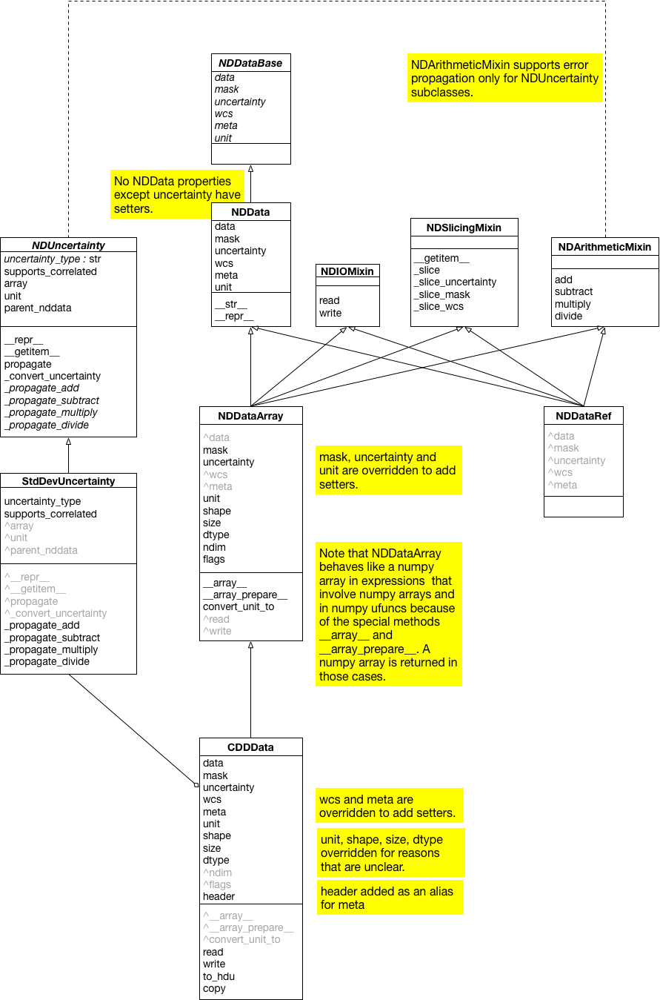
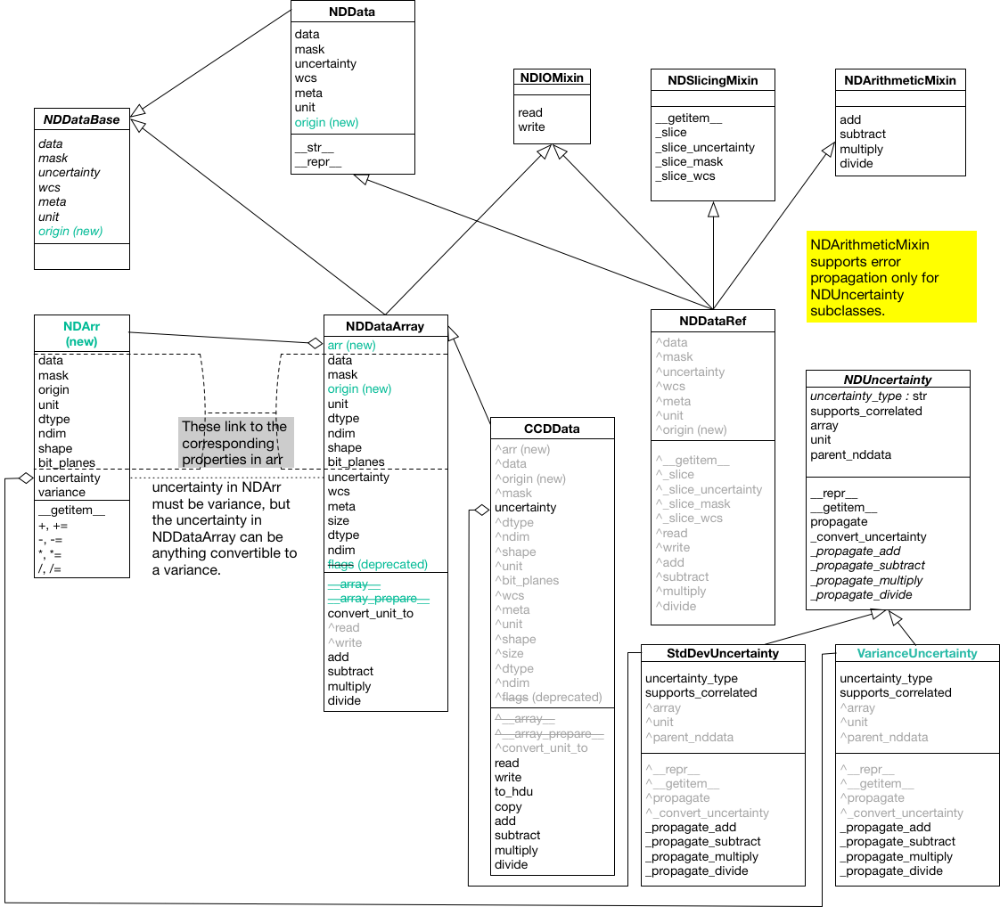

Rework NDData framework
-----------------------

author: Perry Greenfield, Russell Owen, Matt Craig

date-created: 2016 March 31

date-last-revised: 2017 December 1

type: Standard Track

status: Discussion

Abstract
--------

This APE proposes a new architecture for NDData that accommodates
the needs of the LSST project and the community in general.

Detailed description
--------------------

This APE originated from a meeting on 2016 March 26-27 with LSST to see if
there could be better integration of LSST software with Astropy core objects.
In particular, could NDData accommodate these needs? The changes discussed
below are believed to be generally useful to the community while also
accommodating the LSST needs. They do raise a number of issues regarding
NDData that have never been completely resolved, and it is hoped that this
APE will help in resolving some of them.

Background
++++++++++

Summary of current ``nddata`` structure
***************************************

The current architecture of the ``nddata`` package is a base class, ``NDDataBase``
that defines the interface, a minimal concrete implementation of that,
``NDData``, intended as a container, and a set of mixins to add slicing,
arithmetic and I/O.

It also includes a class, ``NDDataRef`` that is ``NDData`` with all of the
mixins. A separate class, ``NDDataArray``, includes the mixins and the special
methods needed for an instance of the class to be treated like a numpy array
in expressions.

There are also a couple of uncertainty classes. The class ``NDUncertainty``
serves to define the uncertainty interface and ``StvDevUncertainty`` implements
error propagation (including limited support for propagation of correlated
errors) for uncertainties expressed as standard deviation.

Finally, ``CCDData``, originally developed as part of ``ccdproc``, was added
to ``astropy`` in version 2.0. It is a subclass of ``NDDataArray``.

The subpackage ``nddata.utils`` includes a few utility functions (e.g.
``block_reduce``) for operating on generic arrays and a ``Cutout2D`` class for
representing postage-stamp cutouts of images.

The class diagram for ``nddata`` is shown below.

Current uses of ``nddata`` classes in other packages
****************************************************

This list summarizes the known packages making extensive use of some aspect of
``nddata``:

+ SunPy: uses the ``NDData`` class as the basis for its data object.
+ The Gemini reduction pipeline uses ``NDDataArray``, at least in part. See
  `ndmapper <https://github.com/jehturner/ndmapper>`_.
+ `ccdproc <http://cccdproc.rtfd.io>`_ uses the ``CCDData`` object throughout
  the package.
+ `phoutils <http://photutils.rtfd.io>`_ uses the ``Cutout2D`` class to
  represent subregions of images.

Summary of the LSST data structure
**********************************

An LSST image is held in an ``Exposure`` object, with two essential attributes:

+ a ``MaskedImage``, which holds the data, a bit plane, and uncertainty represented as variance, and includes an origin.
+ an ``ExposureInfo``, which includes all metadata.

A few of the important differences between this an the current ``nddata`` classes are:

+ the presence of an origin (``xy0``) in the ``MaskedImage``.
+ when an ``Exposure`` is sliced the metadata (i.e. ``ExposureInfo``)
  is not changed; instead the origin is updated.
+ Uncertainty must be variance.

The first two of the differences are related -- because a ``MaskedImage``
keeps track of its origin in the original image, the original WCS can be used
without modification and does not need to be sliced.

Note that the `Cutout2D class <http://astropy.readthedocs.io/en/stable/nddata/utils.html#d-cutout-images>`_
in ``nddata.utils`` includes enough information about the original image to
recover pixel locations in the original and, if a WCS is provided, to
transform between pixel and world coordinates in the cutout. Though the
implementation is quite different than that of LSST's ``Exposure``, the idea
is similar.

Issues raised at pyastro16 and the astropy/LSST meeting, and at pyastro17
*************************************************************************

The issues that LSST raised mainly are itemized as follows:

1. They wish to have two levels of NDData-like objects, one essentially
with no metadata, and the other incorporating extra information regarding
exposures including standard metadata, optional metadata and WCS. The
advantage of this split is that numerical operations on the simpler object
have unambiguous interpretations.

2. They require masks that support multiple bit planes and options for
generating boolean masks from selections on bit planes. This issue was
also discussed at a pyastro unconference session a few days earlier with
some tentative agreement on how to accomplish this.

3. The simpler NDData-like object was required to have information on the
origin of the array, if sliced from another array. It also holds the mask
and uncertainty information. This corresponds to what they call their
MaskedImage object. They support simple arithmetic operations for these
objects, propagating masks and uncertainty. They represent uncertainty as
variance.

4. Their Exposure object corresponds more to astropy’s NDDataArray object, though
the organization is somewhat different. It holds a reference to a ``MaskedImage``
object, and another attribute is what is called the ``ExposureInfo`` object.
The ExposureInfo object has some standard attributes such as filter, exposure
time and a few others, as well as WCS and a junk drawer for
all other metadata (what we currently use .meta for).

Names
+++++

In accommodating this separation (and augmentation to a limited degree), it
is important to deal with naming issues carefully as each community reads
different meaning into terms since they have used different terminology
previously.

For the purposes of this APE, we will assume that the name for the simpler
object is ``NDArr``. This name does not appear to have any other usage in the
Python community.  Since metadata and other more complex aspects have been
removed from the concept, supporting arithmetic operations becomes much more
straightforward, even with masks. Propagation of uncertainty is included,
though propagation of uncertainty is certainly not universally
straightforward. For both masks and uncertainty, it will be possible to create
the NDArr object with options not to propagate one or the other or both to
forestall complaints from those for which these operations will be considered
invalid.

One question is whether we should continue to use NDData to represent the
more complex object (thus breaking backward compatibility), or simply
decide on a different object while deprecating use of NDData.

This APE preserves the names of many of the current classes in nddata while
changing some of the internal implementation to facilitate easy interoperation
with LSST. The rearrangements described below will hopefully clarify to
potential users what the intended use of each class is.

The abstract base class ``NDDataBase`` will remain, with the addition of an
attribute ``origin``, defines the minimal interface of nddata objects and is
intended for use by those who need a class whose implementation differs
substantially from that of the concrete classes in nddata if the data cannot
simply be placed in the concrete container class, ``NDData``.

The class ``NDData`` is a minimal concrete implementation of the nddata
interface and can, if desired, be extended using the mixin classes included in
the nddata module. The class ``NDDataRef`` includes all of the mixin
functionality. THese classes are unchanged

The class ``NDDataArray`` subclasses directly from ``NDDataBase`` because its
internal implementation differs significantly from that of ``NDData`` and
arithmetic is largely delegated to its ``NDArr`` attribute. It is useful as a
fairly general class appropriate for two dimensional gridded data (though
nothing in the class precludes its use for higher dimension data).

The class ``CCDData``, which subclasses from ``NDDataArray`` is, as its name
implies, intended to for use with data from a CCD. It differs from
``NDDataArray`` in a few ways that make it less general; for example, it
includes methods for easy io to FITS, requires that a unit be defined for the
data, and requires that uncertainty be the standard deviation.

``NDArr`` will support optional units since the propagation of units is
unambiguous in mathematical operations.

Supported numerical operations for NDArr are: (+,-,*,/). While the discussion
precluded use of ufuncs, there is no intrinsic reason ufuncs cannot be
supported, so this APE will presume they are supported (eventually; there
is no implied commitment to support this functionality immediately). Ufuncs
shall only work on dimensionless units if units are present.

``NDArr`` objects will support simple slicing (no striding, at least in the
initial proposal). Slices will be based on array indices and no other
interpretation.

``NDArr`` objects will retain information about their parent if derived through
a slicing operation. This information shall include a pointer to the parent
NDArr object, and the bounding box used to obtain the slice. When involving
binary arithmetic operations, between two ``NDArr`` objects that have different
parents (or are themselves distinct parents), there will be no pointer to
the original parent(s) present, nor will the bounding box information be
retained

If operations are unary, parentage and bounding box information is propagated.
For binary operations with two ``NDArr`` objects, operations
will retain parentage and bounding boxes only if both operands share the same
parents and bounding box. If they don't, an exception is raised.

The ``NDArr`` object will permit indexing relative to the parent through a special
attribute.

NDData Details
++++++++++++++

Composition instead of Inheritance
----------------------------------

NDData will not be a subclass of ``NDArr``. Instead it will contain references
to an ``NDArr`` object. To avoid confusion, the attribute that contains the
``NDArr`` object will be .arr.

One possible way to rearrange nddata is this:

Need for ExposureInfo object?
-----------------------------

This is used by LSST to store information about the exposure such as filters,
exposure time, etc. but all that is really needed is an isomorphic mapping
to corresponding information in the astropy object. The question is: does
it make sense to encapsulate that information in a single attribute, and
whether all think that these attributes are "astropy-universal”. For the
purposes of this, the only standard attribute is most likely the WCS.

Items such as exposure time and filters could be relegated to the meta
attribute. Making attributes such as these at the top level could be done
through subclasses, though it may lead to many variants. Perhaps the best way
to deal with this is for applications or libraries to state their requirements
for items required to be in meta and leave it at that.

Masking
+++++++

The implementation of ``NDData`` and subclasses in astropy versions through
v2.x uses "mask" in a very different sense than the LSST stack. In astropy,
"mask" means a binary mask that follows the numpy masked array convention for
the meaning of ``True`` and ``False``: ``True`` means the pixel is masked and
should not be used. In the LSST stack, the ``mask`` of a ``MaskedImage`` is a
bit plane. On some planes ``True`` means reject the pixel, on others it means
the pixel is good.

The original proposal to handle this difference was to create a mask object
that could behave like either a astropy-like binary mask or a more complicated
bit plane (see `alt-mask`_).

The current proposal keeps the current astropy name ``mask`` for a boolean mask
that follows the numpy convention. The mask-related attributes and methods would be:

+ a``mask``: a property that returns a numpy-convention binary mask.
  It may either be derived from a bit plane or be set directly; *however*, it
  is an error to directly set the mask if the ``bit_plane`` has already been
  set.
+ ``bit_plane``: a property storing a bit plane. The bit plane object must
  have a method ``_calculate_binary_mask`` from which a boolean ``mask`` is
  calculated when needed. The ``bit_plane`` may only be set if the ``mask``
  has not already been explicitly set.

Binary Operations on Masks
++++++++++++++++++++++++++

When applying binary operations to two different objects
with masks and/or bit planes, the result should be:

1. If both objects have only boolean masks, the result is the logical "or" of
   the input masks.

2. If both objects have bit planes, the boolean result (logical "or") of
   matched bit planes for those that have matches and simple copy
   of bit planes that don’t match. An error results if the total required bit
   planes exceeds 64 (until larger int sizes are supported universally in numpy
   or we build an interface to a higher dimensionality of int arrays to
   support more bit planes).

3. If one object has a boolean mask and the other a bit plane, the result is a
   bit plane with the boolean mask applied to each bit plane.

Uncertainty
+++++++++++

The container class ``NDData`` places no restriction on the uncertainty
except that it has a property ``uncertainty_type`` that returns a string.

The ``NDArr`` object shall have an ``uncertainty`` that is an instance of the
``VarianceUncertainty`` class and a ``variance`` attribute that exposes the
content of the ``array`` attribute of the ``VarianceUncertainty``. A value of
``None`` is not permitted; a scalar 0 is just as convenient and is broadcastable
to the data array. By default it will propagate, though ``NDArr`` objects may,
in the future, have an attribute (and method to set it) to turn off automatic
propagation.

The ``NDDataArray`` class permits any type of uncertainty that is convertible
to variance, e.g. standard deviation. It's uncertainty will be stored in the
``NDArr`` instance of which it is composed, with the uncertainty translated to
the type the user desires by the class.

The ``CCDData`` class will continue to have a ``StdDevUncertainty`` as its
``uncertainty``.

WCS
+++

There does not appear to be any change needed for how WCS will be handled.

Branches and pull requests
--------------------------

[TBD]
Any pull requests or development branches containing work on this APE should be
linked to from here.  (An APE does not need to be implemented in a single pull
request if it makes sense to implement it in discrete phases). If no code is yet
implemented, just put "N/A"

Implementation
--------------

The initial implementation of bit planes will be ``uint64`` numpy arrays with
planes selected for inclusion in calculating the binary mask by a masking
integer. The bits in that integer will indicate which bit planes should be
included. An interface that allows named bit planes will also be developed,
initially as a

Backward compatibility
----------------------

It is the intent of this APE that user-facing classes be modified
only a backwards-compatible way in astropy 3.0, though some things
will be deprecated for eventual removal in astropy 4.0.

API additions
+++++++++++++

+ The attribute ``origin`` is added to ``NDDataBase`` and its subclasses.
+ These classes are added to the ``nddata`` package: ``NDArr``,
  ``VarianceUncertainty``, and a bit plane class ``BitPlane``.

API deprecations for removal in astropy 4
+++++++++++++++++++++++++++++++++++++++++

+ The ``FlagCollection`` class and the ``flags`` attribute of ``NDDataArray``
  and ``CCDData``. This functionality will be replaced by an implementation
  of bit planes.
+ The ``__array__`` and ``__array_prepare__`` methods of ``NDDataArray``
  and ``CCDData``, which allow them to be used as numpy arrays in expressions.

Alternatives
------------

If there were any alternative solutions to solving the same problem, they should
be discussed here, along with a justification for the chosen approach.

.. _alt-mask:

Alternative masking proposal
++++++++++++++++++++++++++++

The mask attribute now will be an instance of a Mask Object (but to support
backward compatibilty, the attribute must have a different name than mask since
the current implementation treats that attribute as a boolean array (or any
object that mimics one). [An alternative option is to assume that the mask
attribute of NDArr is a callable whereas the mask attribute of NDData represents
a boolean array; this would be workable, but also likely confusing]
This APE proposes that the new attribute have the name: lone_ranger.
Well, perhaps dmask.

As objects, masks may take many internal forms. For example, they may be
simple boolean arrays, but they may also have many bitplanes or even be
computed masks. The only requirement is that this object implement a
callable interface such that it returns a boolean array when called with
no positional or keyword arguments. These masks may implement any number
of customizations to the callable (e.g., optional keyword arguments) as
well as methods to set the default behavior for the callable (i.e., when
called with no arguments or keywords).
The returned boolean array must be broadcastable to the underlying data array
(a scalar boolean is permitted).

As an example for bitplane masks:

- ``nda.dmask()`` returns a boolean array

- ``nda.dmask.apply_flags(…)`` sets how the bit planes are to be used to generate a boolean result when ``ndd.dmask()`` is used

- ``nda.dmask(select=nda.dmask.bitplanes['saturated'] + nda.dmask.bitplanes['dead_pixels'])``

Decision rationale
------------------

<To be filled in by the coordinating committee when the APE is accepted or rejected>
